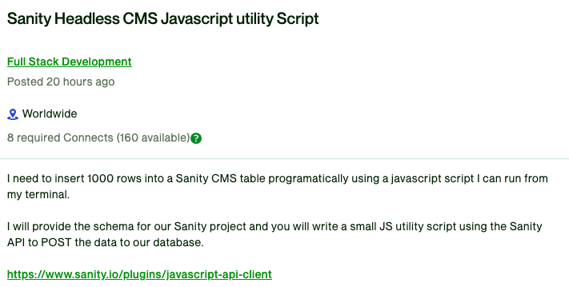

# README

## Description 

An Upwork JoB Solution using Sanity CMS and Javascript to write a POST Script.
The Goal was to write a Javascript Script that uses Sanity API to insert thousands of rows into a table in Sanity CMS project.

## Setup and Configuration

### Install dependencies
- `npm install @sanity/client`

### Create Sanity Project (Web)
- 
### Obtain Sanity Project Credentials(Web)
- projectId and dataset
- Adjust script to match your credentials

### Setup Sanity 
- `npm create sanity@latest -- --template clean --create-project "Sanity Test" --dataset production`

### How to Run - Switch Directory
- `cd /Users/wealthybeans/GIT/sanity-test-project-2/ls`

### Start application locally
- `npm run dev`

### Run Script
- `node PostScript.js`
